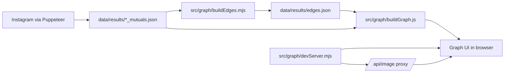

# Instagram Graph

[](https://nodejs.org/)
[](https://js.cytoscape.org/)
[](https://pptr.dev/)

Analyze your Instagram network and explore it as an interactive graph with profile pictures, weighted edges, and neighborhood highlighting.

## Table of Contents

- [Overview](#overview)
- [Features](#features)
- [Quick Start](#quick-start)
- [Requirements](#requirements)
- [Configuration](#configuration)
- [Commands](#commands)
- [Workflow](#workflow)
- [Architecture](#architecture)
- [Project Structure](#project-structure)
- [Output Files](#output-files)
- [Troubleshooting](#troubleshooting)
- [Contributing](#contributing)
- [Security Notes](#security-notes)

## Overview

This project combines:

- Puppeteer-based data extraction from Instagram
- Relationship graph generation from mutual followers
- Cytoscape-powered interactive visualization
- A local image proxy to avoid CORS issues with Instagram CDN profile pictures

## Features

- Collect followings, followers, and mutual follower relationships
- Generate weighted graph edges in `data/results/edges.json`
- Render profile pictures directly inside graph nodes
- Click-to-focus interaction (selected node + neighborhood)
- Tunable graph spacing and force layout parameters

## Quick Start

```bash
npm install
```

Create a `.env` file:

```env
IG_USERNAME=your_instagram_username
ZYTE_API_KEY=your_zyte_api_key
ZYTE_PROJECT_ID=your_zyte_project_id
ZYTE_SPIDER=your_spider_name
```

Run the full flow:

```bash
npm run start
node src/graph/buildEdges.mjs
npm run graph
```

Open:

```text
http://localhost:5173
```

## Requirements

- Node.js 20+
- npm
- An Instagram account that can be authenticated through the browser profile used by Puppeteer

## Configuration

1. Add `.env` in the project root.
2. Set at least `IG_USERNAME`.
3. Keep your logged-in browser profile in `data/chrome-profile` (used during scraping sessions).

## Commands

```bash
# Run analysis once
npm run start

# Run analysis in watch mode
npm run dev

# Run scraper bot on Zyte platform
npm run zyte:run

# Start graph UI + local image proxy
npm run graph

# Auto-fix formatting/style
npm run fix
```

## Workflow

1. Run data analysis:

```bash
npm run start
```

2. Build weighted edges:

```bash
node src/graph/buildEdges.mjs
```

3. Start the graph server:

```bash
npm run graph
```

4. Navigate to `http://localhost:5173`.

## Architecture



## Project Structure

```text
src/
	analysis/         # scraping orchestration
	browser/          # Puppeteer session and page injectors
	cli/              # CLI entrypoints
	graph/            # edge builder, graph UI, local server
	storage/          # data persistence helpers
data/
	chrome-profile/   # local browser profile/session data
	results/          # generated JSON outputs
```

## Output Files

Main outputs are generated in `data/results`:

- `<username>_followers.json`
- `<username>_followings.json`
- `<username>_mutuals.json`
- `edges.json`

## Troubleshooting

### Zyte deploy error: scrapy.cfg is not found

This repository is a Node.js project, not a Scrapy project. Zyte must deploy it as a custom image.

This repo now includes:

- `scrapinghub.yml` with image deploy enabled (`image: true`)
- `Dockerfile` for image build
- `scripts/start-crawl` and `scripts/shub-image-info` required by Zyte custom image contract

Before deploy, set your Zyte project ID in `scrapinghub.yml`:

```yaml
projects:
	default:
		id: 123456
		image: true
```

Then deploy with custom image flow:

```bash
shub image upload
```

After deploy, run spider name:

```text
run-zyte-bot
```

### Zyte runtime error: Missing required environment variable

If logs show missing `ZYTE_API_KEY` or `ZYTE_SPIDER`, set job environment variables in Zyte for spider `run-zyte-bot`.

Required at runtime:

- `ZYTE_API_KEY` (or `SHUB_APIKEY` / `SCRAPINGHUB_APIKEY`)
- `ZYTE_SPIDER` (the target spider to schedule)

Optional:

- `ZYTE_PROJECT_ID` (if omitted, it is inferred from `SHUB_JOBKEY`)

You can also pass target spider via job arguments:

```text
target_spider=your_spider_name
```

or

```text
zyte_spider=your_spider_name
```

### Profile images are missing

- Start the UI with `npm run graph`.
- Open `http://localhost:5173` (same-origin image proxy is required).
- The server endpoint `/api/image` avoids CDN CORS blocking.

### Nodes are too close together

Adjust layout values in `src/graph/buildGraph.js`:

- `idealEdgeLength`
- `nodeSeparation`
- `nodeRepulsion`

### Data is incomplete or outdated

- Verify Instagram login/session in `data/chrome-profile`.
- Re-run `npm run start`.
- Rebuild edges with `node src/graph/buildEdges.mjs`.

## Contributing

1. Create a feature branch.
2. Keep changes focused and small.
3. Run `npm run fix` before opening a PR.
4. Include clear reproduction and verification steps in PR descriptions.

## Security Notes

- The repository may contain local browser session data under `data/chrome-profile`.
- Do not commit credentials, session files, or other sensitive local artifacts.